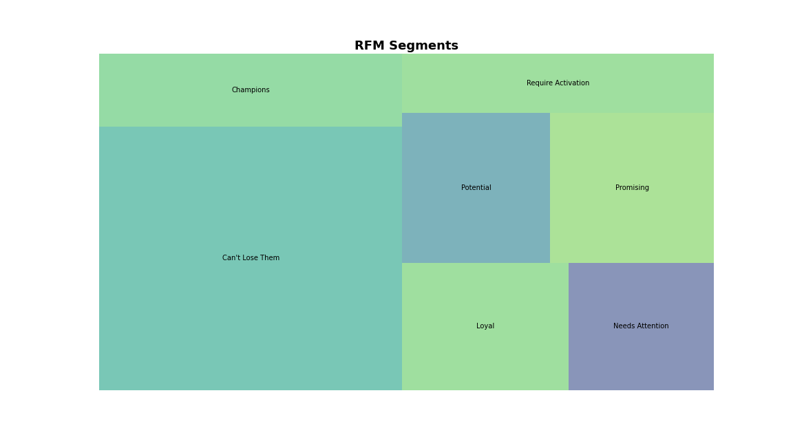

# RFM Model 
### Model for RFM Segmentation. Credit to [Yexi Yuan](https://towardsdatascience.com/@blaizh) for his [guide](https://towardsdatascience.com/recency-frequency-monetary-model-with-python-and-how-sephora-uses-it-to-optimize-their-google-d6a0707c5f17) on Medium and [carrie1](https://www.kaggle.com/carrie1) for the [dataset](https://www.kaggle.com/carrie1/ecommerce-data) used.

This script segments customers in the Ecommerce dataset using the **RFM Model**, applying a simple Clustering methodology first and then impementing **K Means**.

### Example

